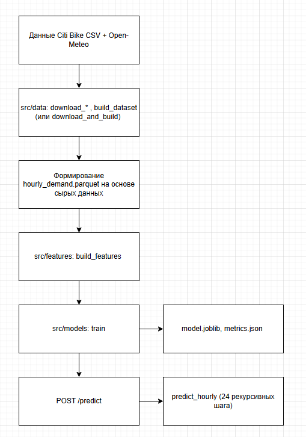

# Отчёт по итоговому проекту по курсу «Инженерия Искусственного Интеллекта»

> Рекомендуемый объём отчёта: 3-5 страниц в эквиваленте Markdown/печатного текста.  
> Отчёт должен позволить преподавателю понять задачу, данные, выбранные модели и результаты экспериментов.

---

## 1. Паспорт проекта

- **Название проекта:** `Почасовой прогноз спроса на использование прокатных велосипедов в Нью-Йорке`
- **Автор:** `Атаманчук Алексей Викторович`
- **Группа:** `КВБО-01-22`
- **Контакт:** `@chockol00`
- **Ссылка на репозиторий:** `https://github.com/n0n4me4all/MIREA_III`

Кратко (2-4 предложения) опишите, о чём проект и что вы хотите получить в итоге.

Проект - сервис почасового прогноза спроса на велопрокат Citi Bike в Нью-Йорке на 24 часа вперёд. Используются открытые данные поездок (2023–2024), почасовая погода Open-Meteo и признаки (календарь, лаги, погода). Финальная модель отдаёт прогноз через REST API (/predict). Итог для пользователя - оценка нагрузки на сутки без ручного разбора сырых CSV.

---

## 2. Постановка задачи и контекст

Опишите:

1. **Предметную область и задачу:**
   - Задача регрессии временного ряда. Для каждого из следующих 24 часов предсказать число начавшихся поездок в системе Citi Bike NYC (по всему городу).
   - Пользователь: аналитик / планировщик велопроката или диспетчер парка. Сценарий: утром или накануне получить почасовой прогноз спроса на сутки, чтобы планировать раскладку велосипедов, персонал, закупки.

2. **Формулировку задачи в терминах ML/ИИ:**
   - Входные данные: история почасового спроса (в API не менее **168** последних часов): timestamp, trip_count; погода на прогноз: temperature_2m, precipitation, wind_speed_10m, relative_humidity_2m, weather_code;
   - Целевая переменная: trip_count на каждый будущий час.
   - Ограничения: прогноз по всей системе (городу), не по станциям;

3. **Целевые метрики качества:**
   Метрики: MAE (поездок/час), RMSE, sMAPE.
   | Метрика | Зачем |
   |---------|--------|
   | **MAE** (поездок/час) | основная, понятна заказчику |
   | **RMSE** | штраф за крупные ошибки |
   | **sMAPE** | относительное сравнение при разном уровне спроса |

---

## 3. Данные

Опишите, какие данные использует проект:

1. **Источник данных:**
   - Citi Bike System Data - https://citibikenyc.com/system-data (архивы S3 tripdata) - История поездок
   - Open-Meteo Historical API - https://open-meteo.com/ - Почасовая погода 

   Данные открытые, обезличенные. Синтетика (`build_dataset --synthetic`) только для pytest.

2. **Структура данных:**
   В data/raw - сырые CSV (citibike и weather) - на их основе составляется основная таблица data/processed/hourly_demand (17 544 строки почасовых записей). Ключевые колонки: 
   |Колонка|Тип|
   |---|---|
   |timestamp|datetime (NY)|
   |trip_count|int|
   |temperature_2m, precipitation, wind_speed_10m, relative_humidity_2m, weather_code|числовые|

3. **Предобработка и EDA:**
   Предобработка (src/data/):
   1. Скачивание архивов Citi Bike (2023 - годовой ZIP, 2024 - помесячно) Jersey City (`JC-`) не используется;
   2. парсинг времени старта поездки, приведение к America/New_York, учёт DST;
   3. агрегация: число поездок с началом в каждом часе;
   4. загрузка погоды за тот же период, объединение по timestamp;
   5. сохранение hourly_demand.parquet; фильтр периода по configs/config.yaml.

   EDA (notebooks/01_eda.ipynb):
   1. выраженная суточная сезонность (пики утро/вечер);
   2. рост уровня спроса: 2023 < 2024;
   3. в часы с осадками спрос ниже;
   4. явных «классов» нет; пропуски после merge контролируются при построении признаков.
   Ноутбуки: EDA - 01_eda.ipynb; подготовка/логика дублируется в src/data/build_dataset.py.


---

## 4. Модели и подходы

Опишите, какие модели вы пробовали и как развивался ваш подход:

1. **Базовые (baseline) модели:**
   Использовался seasonal naive (24/168) - спрос 24/168 ч назад (src/models/baselines.py). Результаты на test (metrics.json): 
   |Модель|MAE|RMSE|sMAPE|
   |-|-|-|-|
   |seasonal_naive_24h|889.33|1277.34|0.439|
   |seasonal_naive_168h|1781.72|2611.48|0.647|

   Naive 24h - планка из‑за суточной сезонности; недельный lag для почасового NYC хуже.

2. **Улучшенные модели и эксперименты:**
   Финальная модель: sklearn_boosting = HistGradientBoostingRegressor (scikit-learn), 17 признаков:
      - календарь: hour_sin/cos, dow_sin/cos, is_weekend, is_holiday, month;
      - погода: 5 полей;
      - история: lag_1h, lag_24h, lag_168h, rolling_mean_24h, rolling_mean_168h.
   Гиперпараметры (train.py): max_iter=300, learning_rate=0.05, max_depth=8, random_state=42. 
   Инференс: рекурсивный прогноз на 24 шага - каждый час добавляется в историю для лагов (src/models/predict.py).
   
   Доп. эксперименты (ablation): какой блок признаков даёт вклад в прогноз - `src/analysis/ablation_study.py`, `notebooks/04_ablation_weather.ipynb`:
      - тот же бустинг на подмножествах признаков: weather_only, calendar_only, lags_calendar, full;
      - ridge_full - Ridge для интерпретации коэффициентов;
      - partial correlation погоды | календарь.
   Ablation - не вторая модель в API: на тех же данных и том же бустинге сравниваются подмножества признаков, чтобы оценить вклад блоков. В API используется только `sklearn_boosting` с полным набором признаков - endpoint `/predict`.
   Ноутбуки: 02_baselines.ipynb, 03_model_comparison.ipynb, 04_ablation_weather.ipynb.

3. **Нейросетевые модели (если применимо):**
   Не использовались


---

## 5. Экспериментальный протокол и результаты

Здесь важно показать, что выбор финальной модели был осмысленным.

1. **Экспериментальный протокол:**
   - Разбиение: time-based split (src/models/evaluate.py → time_split):
      - test - последние 14 дней периода (test_days в config);
      - val - 14 дней перед test;
      - train - всё остальное до val.
   - Обучение финальной модели: train + val объединяются, затем fit; метрики naive и boosting считаются на test. Test-период: 2024-12-17 23:00 - 2024-12-31 23:00 (America/New_York) (`metrics.json`). Без утечки: лаги и rolling только из прошлого; тесты `test_lag_features_no_future_leakage`.
   - Ablation: те же границы test, те же даты.

2. **Сравнение моделей по метрикам:**

   Таблица 1 - основные модели (test):

   | Модель / конфигурация | Описание | MAE | RMSE | sMAPE | Комментарий |
   |-|-|-|-|-|-|
   | seasonal_naive_24h | Вчера в это же время | 889.33 | 1277.34 | 0.439 | Выбранный baseline|
   | seasonal_naive_168h | Неделя назад | 1781.72 | 2611.48 | 0.647 | Слабее для почасового ряда |
   | sklearn_boosting | HGBR, 17 признаков | 258.76 | 486.00 | 0.150 | Финальная модель |

   Таблица 2 - ablation (test те же даты):

   | Модель / конфигурация | Описание | MAE |
   |-|-|-|
   | weather_only_boosting | Только погода | 1393.40 |
   | calendar_only_boosting | Только календарь | 1328.18 |
   | lags_calendar_boosting | Лаги + календарь | 267.98 |
   | full_boosting | Все признаки | 258.76 |
   | ridge_full | Ridge, все признаки | 587.37 |

   Графики: artifacts/figures/metrics_comparison.png, forecast_test.png, partial_corr.png, demand_monthly.png.

3. **Выбор финальной модели:**
   - Выбрана: sklearn_boosting (final_model в metrics.json) - лучший MAE/RMSE/sMAPE на test среди всех сравниваемых;
   - trade-off: naive проще, но ошибка ~3.4× выше по MAE; lags_calendar почти догоняет full, но полный набор включает погоду для сценария «известен прогноз погоды».

---

## 6. Архитектура решения и сервис

Опишите, как из модели получился работающий сервис:

1. **Архитектура пайплайна:**
   

2. **API и endpoints:**
   | Endpoint | Назначение |
   |----------|------------|
   | `GET /health` | статус, флаг `model_loaded` |
   | `GET /model-info` | имя модели, метрики финальной на test |
   | `POST /predict` | прогноз на `horizon` (по умолчанию 24 часов) |

   - Тело `/predict`: `history` (≥168 точек - записи старше недели), `future_weather` (≥horizon - прогноз погоды на дату прогноза), опционально `horizon`.  
   - Ответ: `forecast[]` (`timestamp`, `predicted_trip_count`), `model_version`, `latency_ms`.  
   Пример: `artifacts/sample_request.json`. Проверка: Swagger `http://localhost:8000/docs` или `python -m src.service.client`.

3. **Технологический стек:**
   Python 3.10+, pandas, scikit-learn, FastAPI, uvicorn, joblib, pyarrow.  
   Docker: `Dockerfile` копирует `artifacts/` и `data/processed/` после обучения.
   
   ```
   python -m uvicorn src.service.app:app --host 0.0.0.0 --port 8000
   docker build -t citibike-demand .
   docker run -p 8000:8000 citibike-demand
   ```

---

## 7. Наблюдаемость, конфигурация и безопасность

Кратко опишите:

1. **Логи и наблюдаемость:**
   Логирование через `src/utils/logging.py`: все ключевые модули (загрузка данных, обучение, API) пишут в один формат, уровень задаётся конфигом (`LOG_LEVEL` в `.env` или значения по умолчанию). При старте FastAPI выполняется загрузка модели из `artifacts/model.joblib`. Если файл отсутствует (не был запущен `train`), в лог попадает ошибка с подсказкой запустить обучение; сервис при этом поднимается, но endpoint прогноза будет недоступен.  
   `GET /health` - быстрая проверка, что модель загружена (`model_loaded: true`).
   При POST /predict в лог: horizon, длина history, latency_ms. Ошибки валидации (например, история короче 168 часов) возвращаются клиенту как HTTP 400 с текстом причины; отсутствие модели - 503 с сообщением, что нужно сначала обучить модель.
   

2. **Конфигурации:**
   - Основной файл - `configs/config.yaml`. В нём заданы: период загрузки данных (start_date, end_date); пути к сырым и обработанным данным (citibike_raw_dir, weather_raw_path, processed_path); параметры модели и эксперимента (horizon, min_history_hours, val_days, test_days, backend); пути артефактов (artifact_path, metrics_path, feature_schema_path); настройки сервиса (host, port, version). При смене периода или горизонта достаточно править yaml и пересобрать parquet/модель
   - `configs/.env.example`: CONFIG_PATH, LOG_LEVEL - шаблон окружения без секретов. Реальный `.env` в git не попадает.
   
   Переопределение: переменная CONFIG_PATH, правка yaml без изменения кода.

3. **Безопасность:**
   Проект работает с открытыми данными и не требует платных API-ключей для погоды (Open-Meteo).
   В git не коммитятся `.env` с любыми локальными настройками; сырые CSV/ZIP поездок - в `data/raw/`. В репозиторий попадают агрегированный файл `hourly_demand.parquet` (почасовой счётчик поездок) и артефакты модели.

---

## 8. Ограничения и дальнейшая работа

Будьте честны:

- какие у проекта есть ограничения (качество, скорость, устойчивость, объём данных и т.п.);
- что бы вы сделали, если бы было больше времени:
  - улучшения модели;
  - улучшения сервиса;
  - улучшения данных и экспериментов.

Пока прогноз по всей системе проката. Все данные объединяются в почасовые записи для упрощения. В рамках дальнейшего развития проекта рассматривается возможность учёта локальных прогнозов погоды (районы/станции), а также идея рассматривать сами районы (группы станций), как минимальные объекты исследования. 
Улучшение API при реализации связи с актуальными данными - не передача истории при обращении к API, а использование последних данных и отправка запросов к API погоды на бэкенде.

---

## 9. Сценарий демонстрации на защите

Опишите, как вы планируете демонстрировать проект:

1. Что вы **запускаете**:
   - сервис, ноутбук, скрипт и т.п.;
2. Какие **1-2 ключевых сценария** вы показываете:
   - пример запроса к `/predict`;
   - пример работы с реальными/демонстрационными данными;
3. На что хотите, чтобы преподаватель обратил внимание:
   - качество предсказаний;
   - устойчивость;
   - удобство API;
   - архитектуру.

Ссылайтесь на команды и инструкции из `project/README.md`.

Кратко показываю структуру project/: data/processed/ (готовый ряд за 2023–2024, 17,5 тыс. почасовых записей), src/ (код пайплайна и сервиса), notebooks/ (EDA и эксперименты), artifacts/ (модель и метрики). Упоминаю, что сырые ZIP в репозиторий не входят. Открываю 01_eda.ipynb, показывая сезонность, разницу будни/выходные, влияние дождя, рост спроса с 2023 на 2024. На основе 04_ablation_weather.ipynb показываю, что полный набор признаков даёт лучший MAE, как и использование модели sklearn_boosting на примере 03_model_comparison.ipynb. Из project/ (venv активирован):
```
python -m uvicorn src.service.app:app --host 0.0.0.0 --port 8000
```
Далее в браузере Swagger (http://localhost:8000/docs) или через скрипт:
```
python -m src.service.client
```
Сценарий: 
GET /health -> model_loaded: true.
GET /model-info -> имя модели и метрики.
POST /predict с телом из artifacts/sample_request.json: в запросе не менее 168 часов истории trip_count и 24 точки future_weather. 
В ответе: массив прогноза из 24 значений predicted_trip_count, поле latency_ms.

Отдельный акцент на подходе к агрегации. Исходные истории поездок Citi Bike за 2023–2024 - это архивы с миллионами строк по отдельным поездкам: в репозиторий и в демонстрацию они не попадают (лежат локально в `data/raw/` или скачиваются по команде из `README.md`). В пайплайне (`src/data/`) выполняется предобработка: парсинг времени старта поездки, часовой пояс NYC с учётом DST, агрегация в почасовой ряд - для каждого часа считается число поездок с началом в этом интервале, затем объединение с почасовой погодой. На выходе один файл `data/processed/hourly_demand.parquet` - порядка 17,5 тыс. записей вместо миллионов строк по конкретным поездкам.

---
